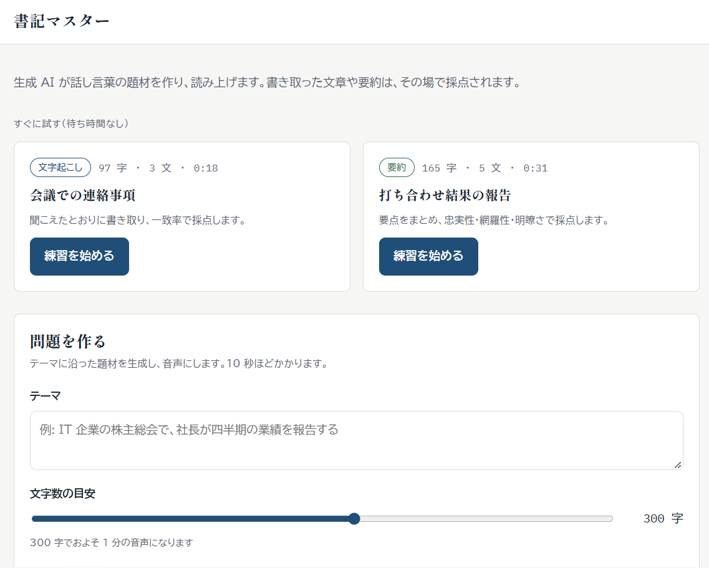
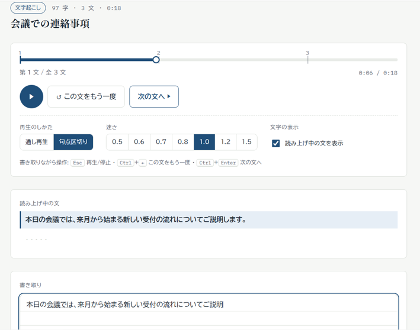
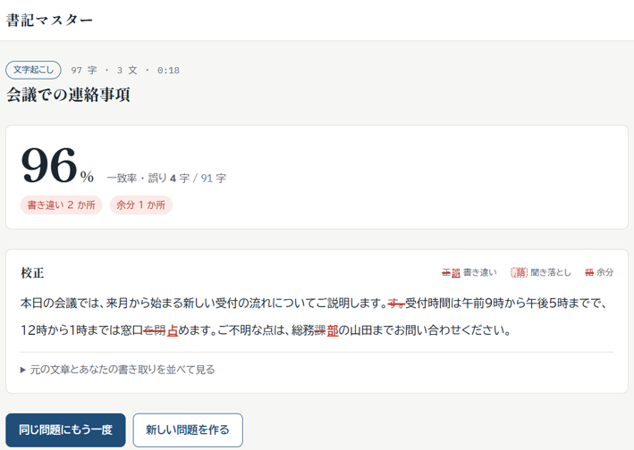
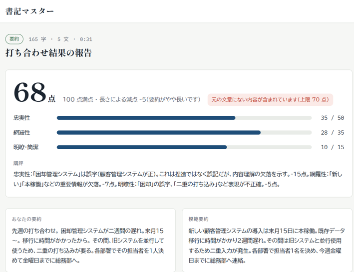
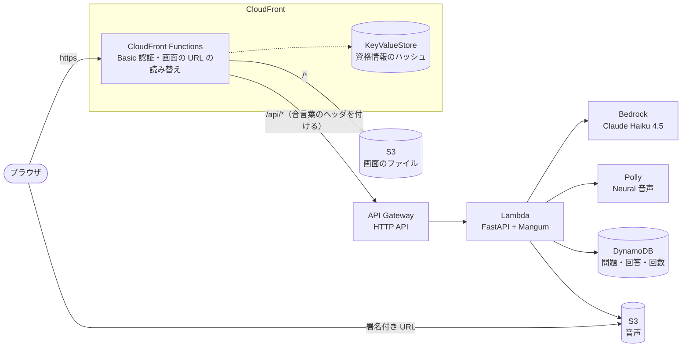

# 書記マスター

録音や自動文字起こしが許されない場（取り調べ、機密性の高い会議など）を想定した、「聞いて書き取る・要約する」力の練習アプリです。
生成 AI が話し言葉の題材を作って読み上げ、書き取った文章や要約をその場で採点します。

---

## できること

| 機能 | 内容 |
|---|---|
| 作問 | テーマ・文字数（50〜500 字）・追加の指示を入れると、Bedrock（Claude）が話し言葉の題材を作り、Polly が読み上げ音声にする（10 秒前後） |
| 練習 | 通し再生（5 秒戻る）と句点区切り（1 文ずつ止まる）、速さの切り替え（0.5〜1.5 倍）、読み上げ中の文の表示切り替え。書きながらキーで操作できる |
| 文字起こしの採点 | 編集距離（Levenshtein）で一致率を出し、誤りを原稿に赤を入れる書き方（取り消し線・聞き落とし）で示す |
| 要約の採点 | LLM が忠実性・網羅性・明瞭さの 3 観点で採点し、講評と模範要約を返す。長さの減点と、元の文章にない内容を付け足したときの上限（70 点）はアプリ側で計算する |
| 再挑戦・サンプル | 同じ問題に何度でも挑戦できる。待ち時間なしで試せるサンプル問題を 2 問用意 |

一般には公開していません（Basic 認証）。

| トップ | 練習（句点区切り） |
|---|---|
|  |  |
| **文字起こしの採点** | **要約の採点** |
|  |  |

---

## 構成



- 画面（React の SPA）と API を、CloudFront の 1 つのドメインから届ける。画面は同じドメインの `/api` を呼ぶだけなので、CORS の設定が要らず、ローカル（Vite が中継）と本番でコードが変わらない
- CloudFront の入口の関数が Basic 認証を行う。正しい資格情報は、ブラウザが送る `Authorization` ヘッダの SHA-256 として KeyValueStore に置き、パスワードそのものはどこにも置かない
- API Gateway の URL を直接呼ばれると Basic 認証を素通りされるので、CloudFront が API へ送るときだけ合言葉のヘッダを付け、Lambda で照合する（合言葉は Parameter Store に置き、テンプレートはデプロイ時に参照するだけ）
- 音声は非公開のバケットに置き、1 時間で切れる署名付き URL で渡す。作った音声・問題・回答は 1 日ほどで自動的に消える（S3 のライフサイクルと DynamoDB の TTL）
- インフラはすべて AWS SAM（[template.yaml](template.yaml)）で管理している。リージョンは東京

---

## 技術選定

| 領域 | 採用 | 理由 |
|---|---|---|
| 生成 AI | Amazon Bedrock（Claude Haiku 4.5、`jp.` 推論プロファイル） | 日本語の品質。tool use で出力の形を強制できる。IAM で認可でき、リクエストが日本国内で完結する |
| 音声合成 | Amazon Polly（Neural、Takumi） | 日本語の自然な音声。Speech Marks で文ごとの開始位置が取れる |
| API | API Gateway（HTTP API）＋ Lambda（Python 3.14、arm64） | アクセスが散発的な練習アプリなので、使った分だけの課金が合う。API Gateway には REST API と HTTP API の 2 種類がある。API キーやキャッシュなど今回使わない機能を持たない代わりに、安くて速い HTTP API を選んだ |
| API の実装 | FastAPI ＋ Mangum | ローカルでは普通の Web サーバーとして動き、Swagger UI で試せる。Pydantic の型がそのまま API の仕様（OpenAPI）になる |
| データ | DynamoDB（オンデマンド、TTL） | 結合の要らないキー参照だけで済む。使わなければ費用がかからない |
| 画面 | React ＋ TypeScript（Vite） | API の型を OpenAPI から生成して共有し、バックエンドとのずれをコンパイル時に見つける |
| 配信 | S3 ＋ CloudFront ＋ CloudFront Functions | バケットを非公開のまま https で配信でき、Basic 認証（CloudFront Functions）・画面の URL の読み替え・API への振り分けを 1 か所で組める。API と同じドメインになるので CORS の設定も要らない。設定はすべて SAM のテンプレートで、ほかのリソースと一緒に管理できる |
| インフラ | AWS SAM | Lambda・API Gateway・DynamoDB を短く書け、段階的に育てやすい |

---

## 設計で考えたこと

- 費用の歯止めを何重かに掛けている。API Gateway の流量制限、作問数の上限（利用者全員で 1 日 30 問・1 か月 200 問。DynamoDB の条件付き更新で数える）、予算を使い切ったら Budget Action で Bedrock と Polly を止める
- API キーを持たない。AWS のサービスはすべて Lambda の IAM ロールで呼ぶ
- 要約の採点のうち、合計・長さの減点・上限はモデルに任せず、アプリで計算する
- 文字起こしの採点では、空白や全角・半角、漢数字と算用数字、句読点の有無など、聞いて区別できない違いをそろえてから比べる
- 音声は題材全体で 1 本にし、Speech Marks で各文の位置を取る。句点区切りの再生は、文の間に入れた無音の中で止める

---

## ディレクトリ構成

```
backend/        API（FastAPI）。app/ が本体、tests/ がテスト、scripts/ が開発用の手動スクリプト
frontend/       画面（React + TypeScript + Vite）
docs/           要件定義書（requirements.md）、API の仕様（openapi.json）、README の画像（images/）
scripts/        デプロイ（deploy.py）と、Basic 認証の資格情報のハッシュ作成（basic_auth_key.py）
template.yaml   AWS のリソース一式（AWS SAM）
```

---

## 開発

- テストはバックエンド 289 件（pytest）、フロント 24 件（vitest）。課金の発生する AWS のサービスは呼ばない。push のたびに GitHub Actions がテスト・型チェック・ビルド・テンプレートの検査を走らせる
- ローカルでは API を uvicorn、画面を Vite の開発サーバーで動かし、デプロイ済みの DynamoDB・S3 につなぐ。デプロイは `scripts/deploy.py`（`sam build` → `sam deploy` → 画面のアップロード）

---

## 費用

作問 1 問あたり約 2 円（題材の生成・音声合成・要約の採点 1 回）。作問の上限（月 200 問）まで使っても約 400 円。ほかのサービスは、この規模なら月に数円程度（CloudFront と Lambda は無料枠に収まる）。アクセスが無ければ、ほぼ 0 円。

---

## ドキュメント

- [要件定義書](docs/requirements.md): 機能要件・非機能要件・実装の単位
- [API の仕様](docs/openapi.json): FastAPI が出力する OpenAPI。画面の型はここから生成している
